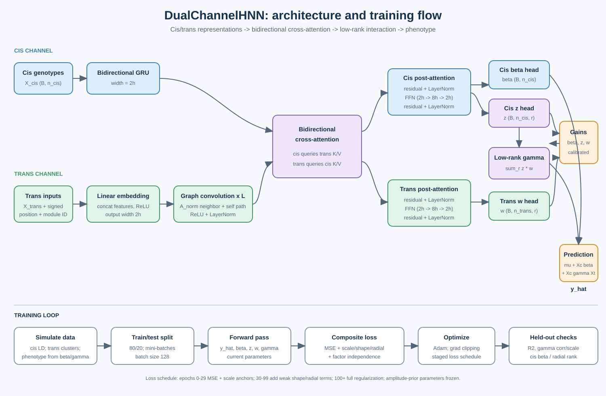

# DualChannelHNN

A PyTorch implementation of a dual-channel cis/trans eQTL model. Cis genotypes are encoded by a bidirectional GRU. Trans genotypes are combined with signed genomic positions and module labels, embedded, and propagated over a fixed normalized radial graph. Bidirectional multi-head cross-attention exchanges information between channels, followed by residual LayerNorm and feed-forward blocks. Separate heads estimate cis additive effects (`beta`) and low-rank cis/trans factors (`z`, `w`); their product forms the interaction matrix `gamma` used for phenotype prediction.

## Architecture



The SVG diagram shows the representation flow, interaction and prediction equations, and the staged training/loss schedule. The model source is [`dual_channel_hnn.py`](dual_channel_hnn.py).

## Model usage

```python
import torch
from dual_channel_hnn import DualChannelHNN

# x_cis: (batch, n_cis), x_trans: (batch, n_trans)
# A_norm: (n_trans, n_trans), trans_positions/module_ids: (n_trans,)
model = DualChannelHNN(
    hidden_dim=32,
    rank=2,
    adjacency=A_norm,
    trans_positions=trans_positions,
    module_ids=module_ids,
    target_gamma_std=target_gamma_std,
    beta_initial_std=beta_initial_std,
    attention_heads=4,
    n_gnn_layers=2,
)
model.calibrate_factor_gains(x_cis[:256], x_trans[:256])
y_hat, beta, z, w, gamma = model(x_cis, x_trans)
```

`gamma` has shape `(batch, n_cis, n_trans)` and is built as `z @ w.T` for each sample. The prediction is `mu + sum(beta * X_cis) + sum(gamma * X_cis * X_trans)`.

## Training design represented by the diagram

The associated simulation harness uses an 80/20 train/test split, mini-batch Adam optimization, a staged regularization schedule, and held-out checks including phenotype R², gamma correlation/scale, radial rank correlation, and cis-effect recovery. Early training emphasizes MSE and output-scale anchors; shape, radial amplitude/ranking, and factor-independence terms are introduced later. The full experiment harness and synthetic-data generator are not included in this repository; this repository contains the reusable model module and its architecture diagram.

## Requirements

- Python 3.10+
- PyTorch

This repository contains synthetic model code only; it does not include real genotype data.
